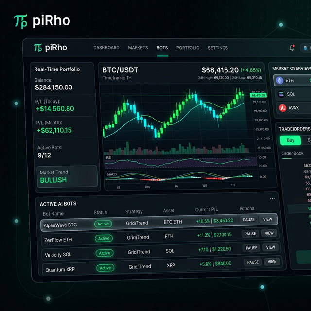
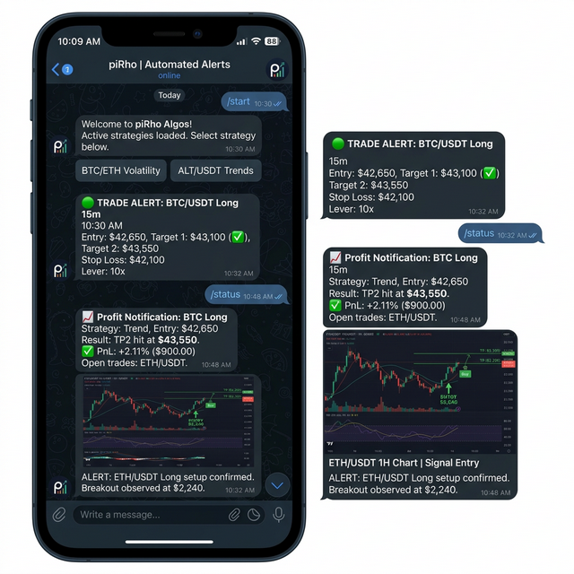

# piRho: The AI-Powered Crypto Trading SaaS Ecosystem



## 🚀 Overview
**piRho** is a comprehensive, institutional-grade SaaS ecosystem designed to revolutionize automated cryptocurrency trading. By combining **Deep Learning (LSTM)**, **Generative AI (LLMs)**, and **Multi-Source Sentiment Analysis**, piRho solves the critical problem of market adaptability in the volatile 24/7 crypto landscape.

The product is split into three core engineering pillars:
1.  **[piRho-bot](./piRho-bot)**: The High-Frequency execution engine & AI brain.
2.  **[piRho-backend](./piRho-backend)**: The multi-tenant SaaS API gateway.
3.  **[piRho-frontend](./piRho-frontend)**: The premium Web3 dashboard for real-time monitoring.

---

## 🧠 The Problem & Our Solution

### The Technical Pain Points
*   **Static Strategies**: Most bots fail when market conditions shift from trending to ranging.
*   **Data Overload**: Manual traders cannot process news, sentiment, and 50+ technical indicators simultaneously.
*   **Security Concerns**: Storing API keys in plain text and lacking multi-tenant isolation.
*   **Non-Scalable Infrastructure**: Running individual bot scripts for each user is inefficient.

### The piRho Advantage
*   **AI-Driven Strategy Selection**: Using OpenAI's LLMs to analyze higher-timeframe market conditions and pick the optimal execution strategy (e.g., VSA for high volume, Supertrend for trends).
*   **LSTM Price Forecasting**: Custom-trained neural networks for every symbol to predict price direction and magnitude with an attention mechanism.
*   **Sentiment Aggregation**: Real-time processing of Fear & Greed Index, CryptoPanic, and NewsAPI for a holistic "market vibe."
*   **Multi-Tenant Orchestration**: A scalable backend that manages thousands of concurrent bot instances as isolated asyncio tasks.

---

## 🛠️ Integrated System Architecture


### 1. piRho-bot (The Alpha Engine)
*   **Execution**: Bybit USDT Perpetual Futures.
*   **AI Stack**: 
    *   **OpenAI GPT-4o**: Strategy recommendation and trade-loss post-mortem analysis.
    *   **PyTorch LSTM**: 3-layer bidirectional LSTM with attention weights for precise entry/exit.
*   **Strategies**: 11+ production-ready strategies including Volatility Clustering, Bollinger Squeeze, and Volume Spread Analysis (VSA).
*   **User UX**: Telegram-first interaction for real-time alerts and manual overrides.

### 2. piRho-backend (The SaaS Backbone)
*   **Stack**: FastAPI (Python), Supabase (Database), Stripe (Billing).
*   **Multi-Tenancy**: Logical isolation of user data and encrypted API key storage (AES-256).
*   **Monitoring**: Integrated Sentry for error tracking and orchestrator health checks.

### 3. piRho-frontend (The Command Center)
*   **Stack**: Next.js 14, Tailwind CSS, Recharts.
*   **Features**: 
    *   Dynamic Landing Page with 3D elements.
    *   Real-time PnL charts and signal logs.
    *   Bot management interface (Create/Start/Stop).

---

## 📈 The Workflow: From Data to Profit

1.  **Ingestion**: `CryptoSentimentAgent` pulls data from 5+ sources; `BybitClient` fetches OHLCV candles.
2.  **Analysis**: 
    *   `LSTMModelManager` predicts the NEXT candle's direction.
    *   `LangGraphAgent` (OpenAI) analyzes the market "regime" (Bullish/Bearish/Volatile).
3.  **Selection**: The AI selects the best-fit strategy from the `StrategyFactory`.
4.  **Execution**: `BotOrchestrator` triggers an asyncio task; `Agents` handle order placement and dynamic Stop Loss/Take Profit.
5.  **Notification**: User receives a beautiful alert via the **Telegram Bot**.



---

## 🎥 Demonstration
```markdown
[](https://drive.google.com/file/d/1J9ZDGzvZplxPHaNkRqIgG0A3A7Af6bAb/view?usp=sharing)
```
*Note: This video covers the full end-to-end flow from dashboard configuration to live trade execution.*

---

## 🛡️ Best Practices & Security
*   **Encryption**: All sensitive exchange credentials are encrypted at rest using a per-user salt.
*   **IP Whitelisting**: Bots only communicate via dedicated static proxy IPs.
*   **Circuit Breakers**: Automatic stop-loss at account level to prevent liquidation in flash-crash events.
*   **Rate Limiting**: Intelligent API call management to avoid exchange bans.

---

## 🗺️ Roadmap
*   **Phase 1 (Current)**: Core trading engine and SaaS MVP.
*   **Phase 2**: Backtesting engine integration & Strategy Marketplace.
*   **Phase 3**: Copy-trading and support for Binance/OKX.

---

## 👨‍💻 Tech Stack Flex
> **"We didn't just build a bot; we built an autonomous trading agent."**
*   **Backend**: `FastAPI` | `Supabase` | `JWT` | `Stripe`
*   **AI/ML**: `PyTorch` | `OpenAI API` | `LangGraph` | `TextBlob`
*   **Frontend**: `Next.js 14` | `Tailwind` | `Recharts` | `Lucide-react`
*   **Orchestration**: `Asyncio` | `Aiohttp` | `WebSockets`

---
*Created by Ravikumar - Revolutionizing Crypto Trading since 2024.*
